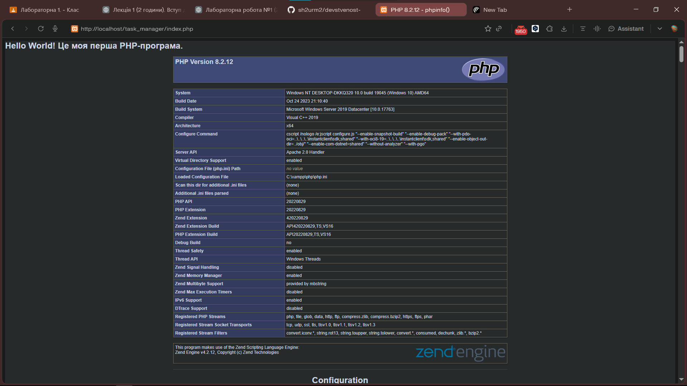

# lab1

1. **Яке призначення вебсервера (наприклад, Apache) у процесі веброзробки?**
**Веб-сервер (Apache)** приймає HTTP-запити від браузера, знаходить потрібний файл на диску, обробляє його і повертає готовий результат (HTML) клієнту. Без нього браузер не зміг би отримати доступ до сайту через мережевий протокол.

2. **Яким розширенням файлу повинен володіти скрипт, щоб сервер обробив його як PHP-код?**
Розширення `.php`. Сервер розпізнає файли саме з таким розширенням і передає їх на виконання PHP-інтерпретатору перед відправкою результату браузеру.

3. **Чому PHP-файл потрібно відкривати через браузер за адресою `localhost`, а не просто подвійним кліком миші у файловому менеджері?**
Тому що PHP — це серверна мова. Код виконується не в браузері, а на сервері. Якщо відкрити файл подвійним кліком, браузер завантажить його напряму з диска і не запустить PHP-інтерпретатор — ви побачите або сирий код, або нічого не спрацює. Через `http://localhost` запит іде до Apache, який обробляє PHP-код і повертає вже готовий HTML.

4. **За що відповідає конструкція `echo` у PHP?**
`echo` виводить (друкує) текст або значення змінної в HTML-сторінку, яка потім відображається в браузері. Це базова конструкція для формування видимого вмісту сторінки.

5. **Яку інформацію виводить функція `phpinfo()` і для чого вона може знадобитись?**
Функція `phpinfo()` виводить детальну інформацію про поточну конфігурацію PHP: версію PHP, встановлені модулі/розширення, налаштування `php.ini` , шляхи до файлів, змінні середовища тощо. Використовується для діагностики — перевірити, чи правильно налаштований сервер, чи ввімкнене потрібне розширення, яка версія PHP встановлена.

